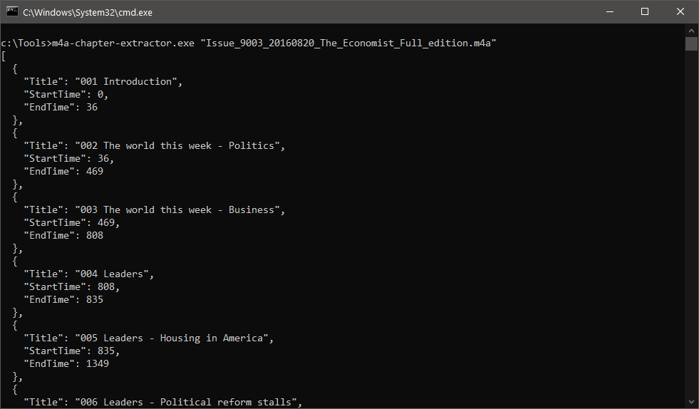

# m4a-chapter-extractor
get chapter information from The Economist Audio podcast (https://jingking.github.io/The-Economist-Audio-List/economistdownload.html) files (in *.m4a format)
<br> This is the .Net version for desktop environment.

## Usage 
````
m4a-chapter-extractor.exe "yourpodcastfilenamehere.m4a" 
````

This will output all chapters inforamtion in json string format

```` 
chapters: [
          { title, startTime, endTime }, // the first chapter
          { title, startTime, endTime }, // the second chatper
           ...
          ],
````


If you want to save the json object strings into a txt file,
````
m4a-chapter-extractor.exe "yourpodcastfilenamehere.m4a" >chapter.txt
````
